

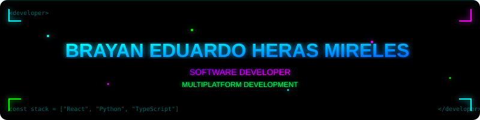


---

---

## ABOUT ME

Software development student at Universidad Tecnologica del Valle de Toluca (UTVT). Previously studied Programming at Prepa CETIS 23.

Focused on software development and creating technological solutions for real-world problems, with emphasis on web development, mobile apps, APIs, and AI-assisted development.

Building my professional profile through practical projects and teamwork. Have held technical leadership roles in academic projects.

---

## TECH STACK

### LANGUAGES

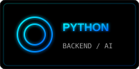
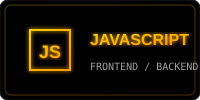

### FRONTEND

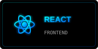
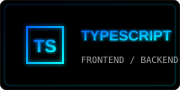

### BACKEND

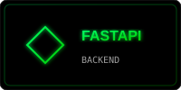
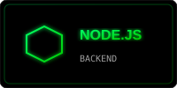
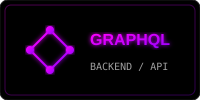

### DATABASE

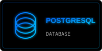
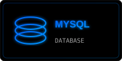

### TOOLS

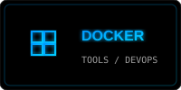
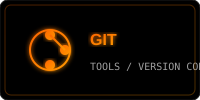

---

## PROJECTS

### ÍXA
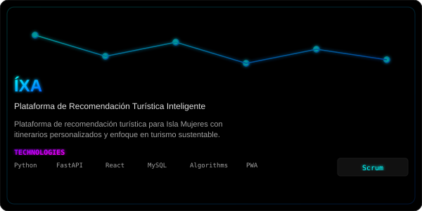

### EcoResiduos
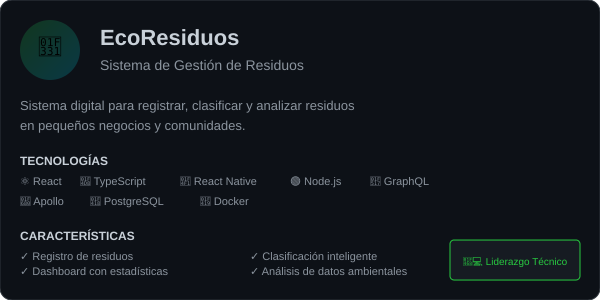

### ComuniAlert
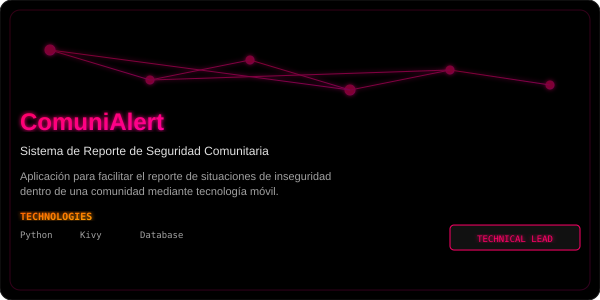

---

## PROJECT EXPERIENCE

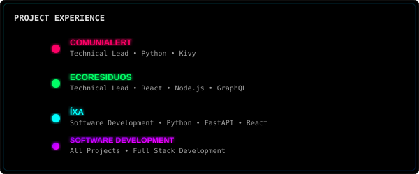

---

## TERMINAL

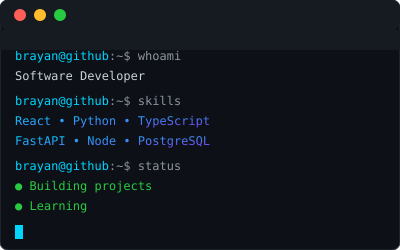

---

## CURRENTLY LEARNING

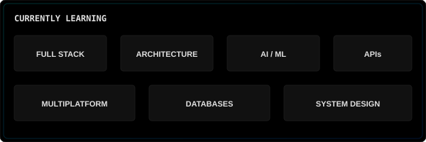

---

## GITHUB STATS

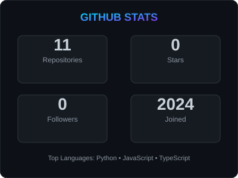

---

## EDUCATION

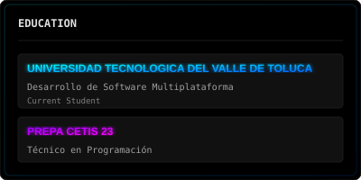

---

## CONTACT

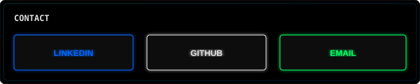

---

THANKS FOR VISITING MY PROFILE

