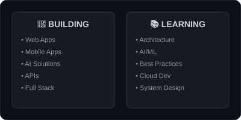

---

## 🎓 SOBRE MÍ

Soy estudiante de **Desarrollo de Software Multiplataforma** en la **Universidad Tecnológica del Valle de Toluca (UTVT)**. Anteriormente estudié Técnico en Programación en Prepa CETIS 23.

Me interesa el desarrollo de software y la creación de soluciones tecnológicas para problemas reales, con especial énfasis en desarrollo web, móvil, APIs e Inteligencia Artificial aplicada al desarrollo.

Actualmente estoy construyendo mi perfil profesional como desarrollador, fortaleciendo mis habilidades mediante proyectos prácticos y trabajo en equipo. En algunos proyectos he tenido responsabilidades de liderazgo técnico.

---

## 🛠️ SKILLS & TECHNOLOGIES

---

## 🚀 PROYECTOS DESTACADOS

### 🏝️ ÍXA

### 🌱 EcoResiduos  

### 🚨 ComuniAlert

---

## 👨‍💻 LIDERAZGO EN PROYECTOS

He tenido responsabilidades de liderazgo técnico en proyectos académicos:

- **EcoResiduos** - Coordinación de desarrollo y arquitectura
- **ComuniAlert** - Liderazgo técnico del proyecto

Estas experiencias me han permitido desarrollar habilidades de coordinación, comunicación técnica y toma de decisiones en entornos de desarrollo colaborativo.

---

## � GITHUB STATS

---

## 🔮 CURRENTLY

---

## 💻 TERMINAL

---

## 🎯 OBJETIVOS PROFESIONALES

Mi objetivo profesional es continuar creciendo como desarrollador de software y especializarme progresivamente en:

- Desarrollo Full Stack
- Aplicaciones multiplataforma
- Inteligencia Artificial aplicada al desarrollo
- Creación de soluciones tecnológicas innovadoras

---

## � CONTACTO

---

**Gracias por visitar mi perfil** 😊

