

---

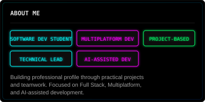

---

## TECH STACK

### LANGUAGES

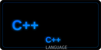
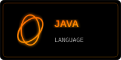

### FRONTEND

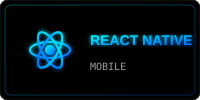
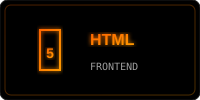
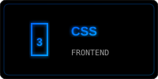
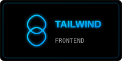

### BACKEND

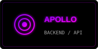

### DATABASE

### MOBILE / MULTIPLATFORM

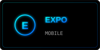
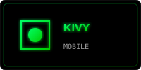

### TOOLS

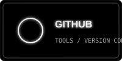
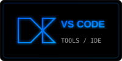

---

## PROJECTS

### ÍXA

### EcoResiduos

### ComuniAlert

---

## PROJECT EXPERIENCE

---

## TERMINAL

---

## CURRENTLY LEARNING

---

## GITHUB STATS

---

## EDUCATION

---

## LANGUAGES

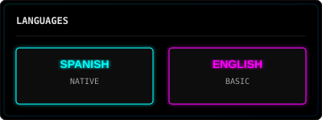

---

## CERTIFICATIONS

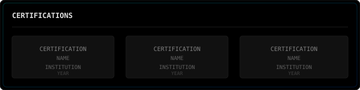

---

## CONTACT

---

THANKS FOR VISITING MY PROFILE

