# mireelees-edu5206

<h3>eledu@github ~ $ ./contributions.sh</h3>

<table>
  <tr>
    <td></td>
  </tr>
</table>

<h3>eledu@github ~ $ neofetch</h3>

<table>
  <tr>
    <td></td>
    <td></td>
  </tr>
</table>

---

## 👨‍💻 About Me

**Brayan Eduardo Heras Mireles** (mireelees-edu5206)

Software Engineering Student | Web & Mobile App Developer

### 🛠️ Tech Stack

- **Languages**: Python, JavaScript, TypeScript
- **Frameworks**: React, React Native, FastAPI, Kivy
- **Databases**: PostgreSQL, MySQL
- **Tools**: Git, GitHub

---

## 📊 Profile Setup

This profile uses custom SVG generation scripts to create an animated terminal-style GitHub profile.

### Scripts

- `scripts/prep_photo.py` - Prepares photo for ASCII conversion
- `scripts/make_ascii_svg.py` - Converts image to ASCII art SVG
- `scripts/make_info_card.py` - Generates neofetch-style info card
- `scripts/fetch_contributions.py` - Fetches GitHub contribution data
- `scripts/render_heatmap_svg.py` - Renders contribution heatmap SVG

### Automation

The contribution heatmap is automatically updated daily via GitHub Actions.

---

## 📫 Contact

- GitHub: [@mireelees-edu5206](https://github.com/mireelees-edu5206)
